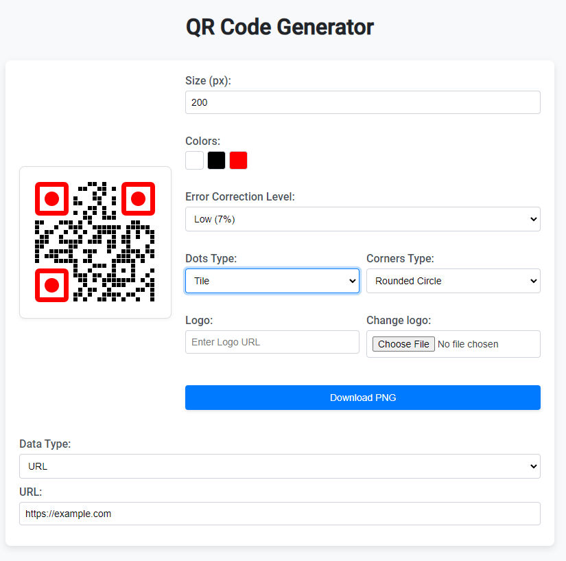

# QR Code Generator

## Installation
Copy index.html and script.js

You can execute index.html locally or on a web server.

## Demo
https://mariusmutu.github.io/qr-generator/

## Customize QR Code
- type (Text, URL, VCARD, SMS, eMail, WiFi) 
- size
- color (dots, corners, background)
- dots and corners type
- upload logo
- error level

